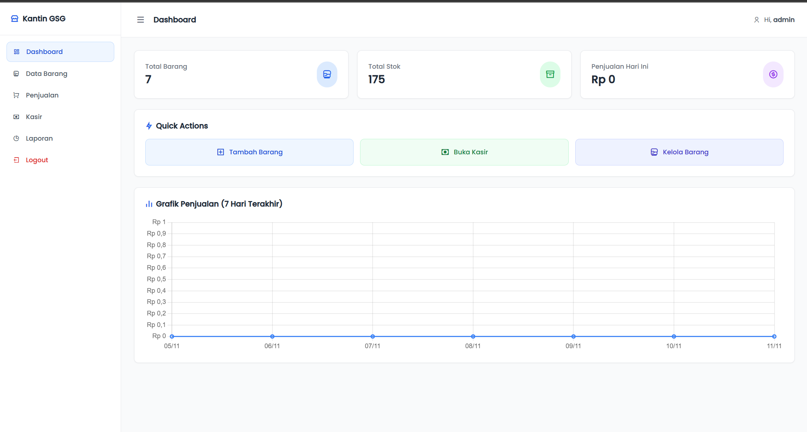

# 💰 Project Kasir GSG

**Project Kasir GSG** adalah aplikasi **Point of Sale (POS)** berbasis web sederhana yang dibuat untuk membantu pengelolaan transaksi penjualan, data produk, dan laporan keuangan pada usaha kecil atau toko.  
Aplikasi ini dikembangkan menggunakan **PHP Native** dan **MySQL** sebagai basis data.

---

## 🖼️ Preview Aplikasi

### 🔐 Halaman Login

### 📊 Dashboard Kasir

> 📸 *Gambar di atas menunjukkan tampilan antarmuka login dan dashboard utama aplikasi Kasir GSG.*

---

## 🚀 Fitur Utama
- 👤 **Login & Logout** – sistem autentikasi untuk admin atau kasir.  
- 🧾 **Transaksi Penjualan** – input data transaksi dengan perhitungan otomatis total harga.  
- 📦 **Manajemen Produk** – tambah, ubah, dan hapus data produk.  
- 📊 **Laporan Penjualan** – ekspor laporan dalam format PDF atau Excel.  
- ⚙️ **Dashboard Ringkas** – menampilkan ringkasan data penjualan dan produk.

---

## 🛠️ Teknologi yang Digunakan
| Komponen | Keterangan |
|-----------|-------------|
| **Frontend** | HTML, CSS, JavaScript |
| **Backend** | PHP Native |
| **Database** | MySQL |
| **Library Tambahan** | TCPDF (untuk PDF), PhpSpreadsheet (untuk Excel) |

---

